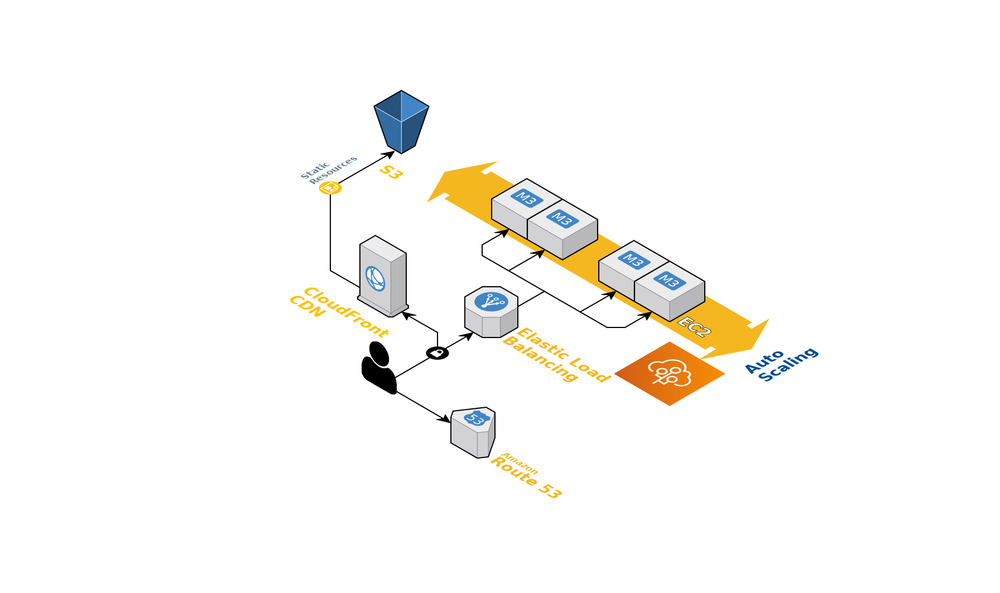

# Streaming-ondemand.xyz

Streaming-ondemand.xyz is a video streaming platform built with NodeJS

## Live preview @ [https://streaming-ondemand.xyz](https://streaming-ondemand.xyz)

## AWS Architecture


## Deployment Requirements

While the project can be used locally to some extent, deployed version is recommended. You will need:
- MongoDB hosting ([mongodb.com offers free 512mb, no credit card required](https://www.mongodb.com/cloud/atlas/register))
- Cloud provider ([Amazon offers free a free for 12 months](https://aws.amazon.com/free/?all-free-tier.sort-by=item.additionalFields.SortRank&all-free-tier.sort-order=asc))
  - NodeJS hosting
  - File hosting
- Domain name
- SSL Certificate
- [Dashy](https://gitlab.com/gonzaloberteri/dashy) or similar

## Setup

```bash
npm i
npm run dev
```
## Tests

```bash
npm test
```

## Contributing
Pull requests are welcome. For major changes, please open an issue first to discuss what you would like to change.

Please make sure to update tests as appropriate.

## License
[MIT](https://choosealicense.com/licenses/mit/)